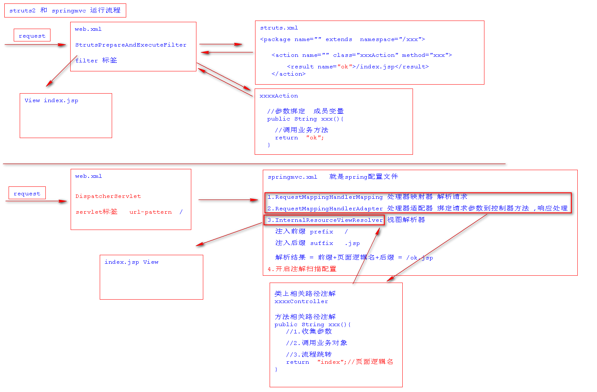
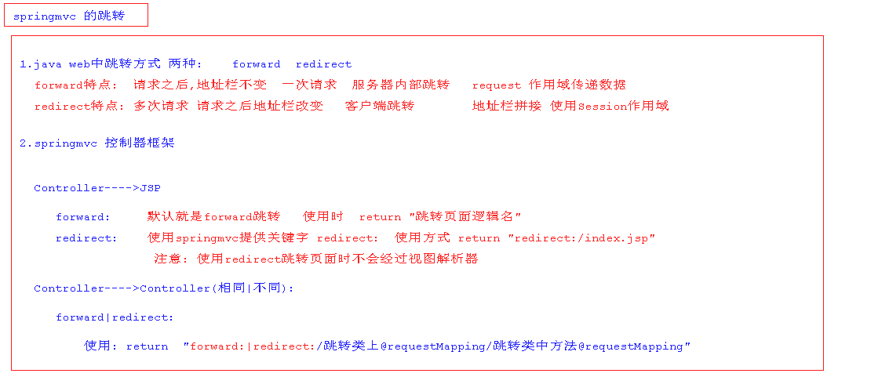
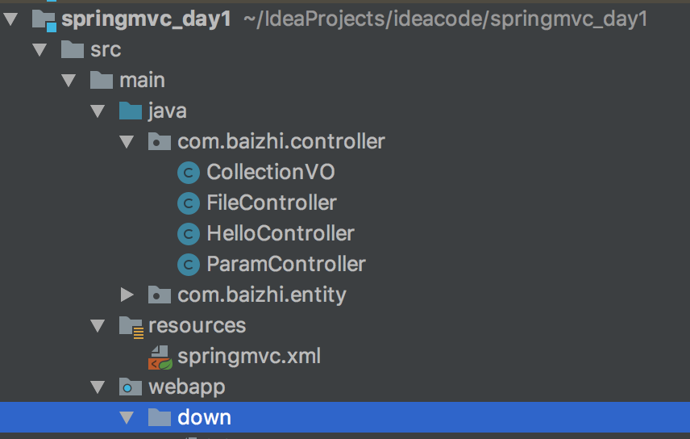
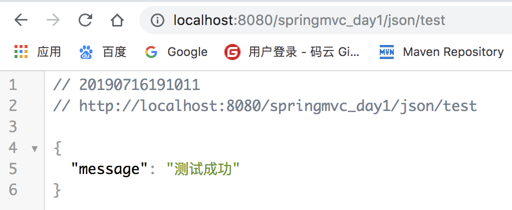

# SpringMVC-Note

## 1.SpringMVC的引言

> `为了使Spring可插入的MVC架构,SpringFrameWork在Spring基础上开发SpringMVC框架,从而在使用Spring进行WEB开发时可以选择使用Spring的SpringMVC框架作为web开发的控制器框架。`

## 2.为什么是SpringMVC

> 1. `可以和spring框架无缝整合`
> 2. `运行效率高于struts2框架`
> 3. `注解式开发更高效`

## 3.SpringMVC的特点

> `SpringMVC 轻量级，典型MVC框架，在整个MVC架构中充当控制器框架,相对于之前学习的struts2框架,SpringMVC运行更快,其注解式开发更高效灵活。`

## 4.SpringMVC与Struts2运行流程对比



## 5.第一个环境搭建

###  1.引入相关依赖

```xml
    <dependency>
      <groupId>org.springframework</groupId>
      <artifactId>spring-core</artifactId>
      <version>4.3.2.RELEASE</version>
    </dependency>
    <dependency>
      <groupId>org.springframework</groupId>
      <artifactId>spring-context</artifactId>
      <version>4.3.2.RELEASE</version>
    </dependency>
    <dependency>
      <groupId>org.springframework</groupId>
      <artifactId>spring-context-support</artifactId>
      <version>4.3.2.RELEASE</version>
    </dependency>
    <dependency>
      <groupId>org.springframework</groupId>
      <artifactId>spring-jdbc</artifactId>
      <version>4.3.2.RELEASE</version>
    </dependency>
    <dependency>
      <groupId>org.springframework</groupId>
      <artifactId>spring-aop</artifactId>
      <version>4.3.2.RELEASE</version>
    </dependency>
    <dependency>
      <groupId>org.springframework</groupId>
      <artifactId>spring-beans</artifactId>
      <version>4.3.2.RELEASE</version>
    </dependency>
    <dependency>
      <groupId>org.springframework</groupId>
      <artifactId>spring-expression</artifactId>
      <version>4.3.2.RELEASE</version>
    </dependency>
    <dependency>
      <groupId>org.springframework</groupId>
      <artifactId>spring-aspects</artifactId>
      <version>4.3.2.RELEASE</version>
    </dependency>
    <dependency>
      <groupId>org.springframework</groupId>
      <artifactId>spring-tx</artifactId>
      <version>4.3.2.RELEASE</version>
    </dependency>
    <dependency>
      <groupId>org.springframework</groupId>
      <artifactId>spring-web</artifactId>
      <version>4.3.2.RELEASE</version>
    </dependency>
		<!--springmvc核心依赖-->
		<dependency>
      <groupId>org.springframework</groupId>
      <artifactId>spring-webmvc</artifactId>
      <version>4.3.2.RELEASE</version>
    </dependency>
 <dependency>
      <groupId>javax.servlet</groupId>
      <artifactId>servlet-api</artifactId>
      <version>2.5</version>
      <scope>provided</scope>
    </dependency>

```

### 2.编写springmvc配置文件

```xml
  <!--开启注解扫描-->
    <context:component-scan base-package="com"/>

    <!--注册处理器映射器-->
    <bean class="org.springframework.web.servlet.mvc.method.annotation.RequestMappingHandlerMapping"/>
    <!--注册处理器适配器-->
    <bean class="org.springframework.web.servlet.mvc.method.annotation.RequestMappingHandlerAdapter"/>
    <!--注册视图解析器-->
    <bean class="org.springframework.web.servlet.view.InternalResourceViewResolver">
        <property name="prefix" value="/"/>
        <property name="suffix" value=".jsp"/>
    </bean>
```

### 3.配置springmvc的核心Servlet

```xml
	<servlet>
    <servlet-name>springmvc</servlet-name>
    <servlet-class>org.springframework.web.servlet.DispatcherServlet</servlet-class>
    <!--指定springmvc配置文件位置-->
    <init-param>
      <param-name>contextConfigLocation</param-name>
      <param-value>classpath:springmvc.xml</param-value>
    </init-param>
  </servlet>

  <servlet-mapping>
    <servlet-name>springmvc</servlet-name>
    <url-pattern>/</url-pattern>
  </servlet-mapping>
```

> `注意: 这里还要加载spring配置,通过在servlet写init­param标签,还是contextConfigLocation属性,value用来加载springmvc配置文件`

### 4.创建控制器

```java
@Controller
@RequestMapping("/hello")
public class HelloController {
    @RequestMapping("/hello")
    public String hello(){
        System.out.println("hello springmvc");
        return "index";//解析结果:前缀+返回值+后缀
    }
}
```

`@Controller`: 该注解用来类上标识这是一个控制器组件类并创建这个类实例

`@RequestMapping`: 

​				`修饰范围: 用在方法或者类上`

​				`注解作用: 用来指定类以及类中方法的请求路径`

​				`注解详解: `

​						`用在类上相当于struts2中namespace在访问类中方法必须先加入这个路径`

​						`用在方法上相当于action标签的name属性用来表示访问这个方法的路径`

### 5.部署项目,启动项目测试

```http
访问路径: http://localhost:8989/SpringMVC-Note/hello/hello
```

----

## 6.SpringMVC中跳转方式

### 1.跳转方式

> `说明 : 跳转有两种,一种forward,一种是redirect。forward跳转,一次请求,地址栏不变,redirect跳转多次请求,地址栏改变。`

```markdown
# 1. Controller跳转到JSP

			forward跳转到页面 :   默认就是forward跳转 		
									 语法:   return "页面逻辑名"

			redirect跳转到页面:   使用springmvc提供redirect:关键字进行重定向页面跳转
      						 语法:   return "redirect:/index.jsp"  
      						 注意:   使用redirect跳转页面不会经过试图解析器

# 2. Controller跳转到Controller
			
			forward跳转到Controller  :  使用springmvc提供的关键字forward:
							 语法:  forward:/跳转类上@requestMapping的值/跳转类上@RequestMapping的值
												   
			redirect:跳转到Controller:  使用springmvc提供关键字redirect:
							 语法:  redirect:/跳转类上@requestMapping的值/跳转类上@RequestMapping的值
```

### 2.跳转方式总结



----

## 7.SpringMVC中参数接收

> ​	`接收参数语法说明:springmvc中使用控制器方法参数来收集客户端的请求参数,因此在接收请求参数时直接在需要控制器方法声明即可,springmvc可以自动根据指定类型完成类型的转换操作`

### 1.接收零散类型参数

> `如: 八种基本类型 +  String + 日期类型`

#### a.前台传递参数

```markdown
# GET 方式传递参数
	http://localhost:8080/SpringMVC-Note/param/test?name=zhangsan&age=19&sex=true&salary=11.11&bir=2012/12/12

# POST 方式传递参数
	<h1>测试参数接收</h1>
    <form action="${pageContext.request.contextPath}/param/test" method="post">
        用户名: <input type="text" name="name"/>  <br>
        年龄:  <input type="text" name="age"/>   <br>
        性别:  <input type="text" name="sex">    <br>
        工资:  <input type="text" name="salary"> <br>
        生日:  <input type="text" name="bir"> <br>
        <input type="submit" value="提交"/>
    </form>
```

#### b.后台控制器接收

```java
@Controller
@RequestMapping("/param")
public class ParamController {
    @RequestMapping("/test")
    public String test(String name, Integer age, Boolean sex,Double salary,Date bir){
        System.out.println("姓名: "+name);
        System.out.println("年龄: "+age);
        System.out.println("性别: "+sex);
        System.out.println("工资: "+salary);
        System.out.println("生日: "+bir);
        return "index";
    }
}
```

> `注意:springmvc在接收日期类型参数时日期格式必须为yyyy/MM/dd HH:mm:ss`

### 2.接收对象类型参数

#### a.前台传递参数

```markdown
# GET 方式请求参数传递
		http://localhost:8080/SpringMVC-Note/param/test1?name=zhangsan&age=19&sex=true&salary=11.11&bir=2012/12/12

# POST 方式请求参数传递
		<h1>测试对象类型参数接收</h1>
    <form action="${pageContext.request.contextPath}/param/test1" method="post">
        用户名: <input type="text" name="name"/>  <br>
        年龄:  <input type="text" name="age"/>   <br>
        性别:  <input type="text" name="sex">    <br>
        工资:  <input type="text" name="salary"> <br>
        生日:  <input type="text" name="bir"> <br>
        <input type="submit" value="提交"/>
    </form>
```

> `注意:在接收对象类型参数时和struts2接收不同,springmvc直接根据传递参数名与对象中属性名一致自动封装对象`

#### b.后台控制器接收

```java
// 1.定义对象
public class User {
    private String name;
    private Integer age;
    private Double salary;
    private Boolean sex;
    private Date bir;
}

//  2.控制器中接收
 @RequestMapping("/test1")
public String test1(User user){
  System.out.println("接收的对象: "+user);
  return "index";
}
```

### 3.接收数组类型参数

#### 	a.前台传递参数

```markdown
# GET 方式请求参数传递
		http://localhost:8080/SpringMVC-Note/param/test2?names=zhangsan&names=lisi&names=wangwu

# POST 方式请求参数传递
		<h1>测试对象类型参数接收</h1>
    <form action="${pageContext.request.contextPath}/param/test2" method="post">
        爱好: <br>
        	看书:  <input type="checkbox" name="names"/> 
        	看电视:<input type="checkbox" name="names"/>
        	吃饭:  <input type="checkbox" name="names"/>
        	玩游戏: <input type="checkbox" name="names"/>
        <input type="submit" value="提交"/>
    </form>
```

#### b.后台控制器接收

```java
@RequestMapping("/test2")
public String test2(String[] names){
  for (String name : names) {
    System.out.println(name);
  }
  return "index";
}
```

> `注意:接收数组类型数据时前台传递多个key一致自动放入同一个数组中`

----

### 4.接收集合类型参数

> `说明:springmvc不支持直接将接收集合声明为控制器方法参数进行接收,如果要接收集合类型参数必须使用对象封装要接收接收类型才可以`

#### a.前台传递参数

```markdown
# GET 方式请求参数传递
		http://localhost:8080/SpringMVC-Note/param/test3?lists=zhangsan&lists=lisi&lists=wangwu

# POST 方式请求参数传递
		<h1>测试对象类型参数接收</h1>
    <form action="${pageContext.request.contextPath}/param/test3" method="post">
        爱好: <br>
        	看书:  <input type="checkbox" name="lists"/> 
        	看电视:<input type="checkbox" name="lists"/>
        	吃饭:  <input type="checkbox" name="lists"/>
        	玩游戏: <input type="checkbox" name="lists"/>
        <input type="submit" value="提交"/>
    </form>
```

#### b.后台控制器接收

```java
// 1.封装接收集合类型对象---->在spring mvc中用来接收集合类型参数
public class CollectionVO {
    private List<String> lists;

    public List<String> getLists() {
        return lists;
    }

    public void setLists(List<String> lists) {
        this.lists = lists;
    }
}

// 2.控制器中接收集合类型参数
@RequestMapping("/test3")
public String test3(CollectionVO collectionVO){
  collectionVO.getLists().forEach(name-> System.out.println(name));
  return "index";
}
```

-----

## 8. 接收参数中文乱码解决方案

> `注意:在使用springmvc过程中接收客户端的请求参数时有时会出现中文乱码,这事因此springmvc并没有对象请求参数进行编码控制,如果需要控制需要自行指定`

```markdown
# 1.针对于GET方式中文乱码解决方案:
<Connector connectionTimeout="20000" port="8080" protocol="HTTP/1.1" redirectPort="8443" URIEncoding="UTF-8"/>
```

## 9.SpringMVC中数据传递机制

### 1.数据传递机制

```markdown
# 1.数据怎么存
			Servlet 作用域 			Struts2  作用域				SpringMVC 作用域
# 2.数据怎么取
			Servlet EL表达式			Struts2  EL表达式		  SpringMVC EL表达式
# 3.数据怎么展示		
			Servlet JSTL标签	 	 Struts2  JSTl标签     SpringMVC  JSTL标签
```

### 2.使用forward跳转传递数据

```markdown
# 1.使用servlet中原始的request作用域传递数据
		request.setAttribute("key",value);

# 2.使用是springmvc中封装的Model和ModelMap对象(底层对request作用域封装)
		model.addAttribute(key,value);
		modelMap.addAttribute(key,value);
```

### 3.使用Redirect跳转传递数据

```markdown
# 1.使用地址栏进行数据传递
	 url?name=zhangsan&age=21

# 2.使用session作用域
	session.setAttribute(key,value);
	session.getAttribute(key);
```

----

## 10.SpringMVC处理静态资源拦截

```markdown
# 1.处理静态资源拦截

# 问题:当web.xml中配置为"/"时,会拦截项目静态资源
    <mvc:default-servlet-handler/>
```

-----

# SpringMVC_day2

## 1.文件上传

> `文件上传`: 指的就是将用户本地计算机中文件上传到服务器上的过程称之为文件上传

### 1).文件上传编程步骤

```markdown
# 1.项目中引入相关依赖
```

```xml
<dependency>
      <groupId>commons-fileupload</groupId>
      <artifactId>commons-fileupload</artifactId>
      <version>1.3</version>
</dependency>
```

```markdown
# 2.开发页面
```

```html
		<h1>文件上传</h1>
    <form action="${pageContext.request.contextPath}/file/upload" method="post" enctype="multipart/form-data">
        <input type="file" name="aaa"/>
        <input type="submit" value="上传文件"/>
    </form>
```

> `注意:`
>
> ​			`1. form表单提交方式必须为post`
>
> ​			`2.form表单的enctype属性必须为multipart/form-data`

```markdown
# 3.开发控制器
```

```java
@RequestMapping("upload")
public String upload(MultipartFile aaa, HttpServletRequest request) throws IOException {
  //获取上传路径
  String realPath = request.getSession().getServletContext().getRealPath("/upload");
  //获取文件原始名称
  String originalFilename = aaa.getOriginalFilename();
  System.out.println("文件名: "+originalFilename);
  //上传文件到服务器
  aaa.transferTo(new File(realPath,originalFilename));
  return "index";
}
```

```markdown
# 4.配置文件上传解析器
```

```xml
<bean id="multipartResolver" class="org.springframework.web.multipart.commons.CommonsMultipartResolver">
  <!--控制文件上传大小单位字节 默认没有大小限制 这里是2-->
  <property name="maxUploadSize" value="2097152"/>
</bean>
```

> `注意:使用springmvc中multipartfile接收客户端上传的文件必须配置文件上传解析器且解析的id必须为multipartResolver`

-------

## 2.文件下载

> ​	<u>文件下载</u>:`将服务器上的文件下载到当前用户访问的计算机的过程称之为文件下载`

### 1).文件下载编程思路

```markdown
# 1.项目中准备下载目录并存在下载的相关文件
```



```markdown
# 2.开发下载控制器
```

```java
 /**
     * 测试文件下载
     * @param fileName 要下载文件名
     * @return
     */
    @RequestMapping("download")
    public String download(String fileName, HttpServletRequest request, HttpServletResponse response) throws IOException {
        //获取下载服务器上文件的绝对路径
        String realPath = request.getSession().getServletContext().getRealPath("/down");
        //根据文件名获取服务上指定文件
        FileInputStream is = new FileInputStream(new File(realPath, fileName));
        //获取响应对象设置响应头信息
        response.setHeader("content-disposition","attachment;fileName="+ URLEncoder.encode(fileName,"UTF-8"));
        ServletOutputStream os = response.getOutputStream();
        IOUtils.copy(is,os);
        IOUtils.closeQuietly(is);
        IOUtils.closeQuietly(os);
        return null;
    }
```

> `注意:下载时必须设置响应的头信息,指定文件以何种方式保存,另外下载文件的控制器不能存在返回值,代表响应只用来下载文件信息`

```markdown
# 3.开发页面
```

```html
<h1>文件下载</h1>
<a href="${pageContext.request.contextPath}/file/download?fileName=init.txt">init.txt</a>
```

------

## 3.@ResponseBody注解使用

> ​	`@ResponseBody`: `为了进一步方便控制器与ajax集成,springmvc提供@responseBody该注解用在方法的返回值上,代表可以将方法的返回值转换为json格式字符串并响应到前台,省去了通过第三方工具转换json的过程`

### 1). 引入相关依赖

```xml
<dependency>
  <groupId>com.fasterxml.jackson.core</groupId>
  <artifactId>jackson-databind</artifactId>
  <version>2.9.0</version>
</dependency>
```

### 2).开发控制器

```java
@Controller
@RequestMapping("json")
public class JsonController {
  
    @RequestMapping("test")
    @ResponseBody
    public Map<String,String> test(){
        HashMap<String,String> map = new HashMap<>();
        map.put("message","测试成功");
        return map;
    }
}

```

### 3).访问测试

> /http://localhost:8989/springmvc_day2/json/test/



-----

## 4.SpringMVC中拦截器

### 1.作用

> `作用:类似于javaweb中的Filter,用来对请求进行拦截,可以将多个Controller中执行的共同代码放入拦截器中执行,减少Controller类中代码的冗余.`

### 2.特点

> * 拦截器器只能拦截Controller的请求,不能拦截jsp
>
> * 拦截器可中断用户的请求轨迹
>
> + 请求先经过拦截器,之后之后还会经过拦截器

### 3.开发拦截器

```java
//自定义拦截器
public class MyInterceptor implements HandlerInterceptor {
    //请求最先经过的方法 返回为true放行请求  返回为false中断请求
    @Override
    public boolean preHandle(HttpServletRequest httpServletRequest, HttpServletResponse httpServletResponse, Object o) throws Exception {
        System.out.println("1");
        return true;
    }
		//控制器方法执行完成之后进入这个方法执行
    @Override
    public void postHandle(HttpServletRequest httpServletRequest, HttpServletResponse httpServletResponse, Object o, ModelAndView modelAndView) throws Exception {
        System.out.println("3");
    }
		//最后执行的方法
    @Override
    public void afterCompletion(HttpServletRequest httpServletRequest, HttpServletResponse httpServletResponse, Object o, Exception e) throws Exception {
        System.out.println("4");
    }
}
```

### 4.配置拦截器

```xml
<!--配置拦截器-->
    <mvc:interceptors>
        <mvc:interceptor>
            <mvc:mapping path="/json/*"/>
            <mvc:exclude-mapping path="/json/test1"/>
            <ref bean="myInterceptor"/>
        </mvc:interceptor>
    </mvc:interceptors>
```

> `/*``: 代表拦截所有请求路径`

-----

## 5.SpringMVC全局异常处理

### 1.作用

> ​	`当控制器中某个方法在运行过程中突然发生运行时异常时,为了增加用户体验对于用户不能出现500错误代码,应该给用户良好展示错误界面,全局异常处理就能更好解决这个问题`

### 2.全局异常处理开发

```java
public class CustomerHanlderExceptionResolver implements HandlerExceptionResolver {
    @Override
    public ModelAndView resolveException(HttpServletRequest httpServletRequest, HttpServletResponse httpServletResponse, Object o, Exception e) {
        ModelAndView modelAndView = new ModelAndView();
        modelAndView.setViewName("500");//跳转到500页面
        return modelAndView;
    }
}
```

### 3.配置全局异常处理

```xml
<!--配置全局异常处理 -->
<bean class="com.baizhi.globalexception.CustomerHanlderExceptionResolver"></bean>
```

## 6.总结

```xml
1.springmvc认识?  了解什么是springmvc

   spring  框架基础之上开发    springmvc  目的   让spring框架插入mvc架构    springmvc在mvc架构中充当c 控制层 控制器框架
   
 
2.springmvc 为什么?  springmvc 优势在哪?
 
   a.springmvc 和 spring 一家公司 一个团队产品    整合无缝的
   
   b.springmvc 开发效率原远高于 struts2 (配置文件)   springmvc2.5 之后推荐  注解式高效灵活

   c.springmvc 运行效率高于struts2   
   
  springmvc 控制器   默认单例  springmvc收集参数使用方法的形参作为参数接收   默认单例        线程不安全  
  struts2   控制器   多例     使用大量成员变量收集参数  private string name,private List<Book> ...... 默认多例       线程安全
	   
      
3.springmvc 运行流程

   请求----->web.xml 核心 Servlet(DispatcherServlet)  /   ----->   找spring三大组件(处理器映射器 处理器适配器  视图解析器)
   
   ----->控制器  ----->  视图解析器  ----> view
   
 
 4.springmvc跳转方式
  
    forward   redirect:
	
	cotroller  到页面:
		
		forward:    默认就是forward   return "页面逻辑名"
		 
		redirect:    使用redirect:关键字    return "redirect:/login.jsp"
		
	controller 到Controller:相同 不同
	
		forward|redirect:
			
			forward:|redirect:/跳转类上@requestMapping的路径/跳转类中方法上@RequestMapping的路径
			

5.springmvc 参数接收

	语法: 使用控制器方法的形参列表接收客户端请求参数   形参列表是不定长参数可以无限声明
	
	1.零散类型的参数接收 
		语法: 保证前台url方式传递参数key和form表单方式input的name属性名与后台控制器中形参变量名一致 自动赋值
		注意: 如果存在日期类型 日期格式默认为"yyyy/MM/dd" 如果要修改默认日期格式 需要使用@DateTimeFormat(pattern="")
		
	2.对象类型的参数接收     
		语法: 保证前台url方式传递参数key和form表单方式input的name属性名与后台控制器中对象中成员变量名一致 自动封装对象
		
	3.数组类型参数接收     
		语法: 保证前台url方式传递的多个参数key和form表单方式多个input的name属性名与后台声明数组变量名一致 自动封装数组
		
	4.集合类型参数接收
		注意: springmvc 不能直接接收集合类型参数   需要将集合放入指定对象中进行接收     推荐使用  VO  value object


6.springmvc中数据处理机制
			
		1.数据怎么存?    作用域 request(forward)  session(redirect 或者地址栏传递参数) servletContext
	
		2.数据怎么取?    EL
		
		3.数据怎么展示?  EL + JSTL
		

7.当web.xml中servlet的url-pattern配置为"/",导致静态资源拦截问题

	<mvc:default-servlet-handler/>

	处理机制: 改变请求解析顺序
	
8.SSM整合开发

	1.spring-mybatis  整合
	
	2.spring-springmvc 整合  无缝整合
	
	注意: 在项目中使用spring 和 springmvc 时存在父子容器,在开发时注意规避父子容器问题
	
9.springmvc中文件上传
	
	公共注意事项:
	
		1.项目中引入commons-fileuplod  commons-io 
		2.开发文件上传页面  表单提交方式必须为 post
		3.表单enctype必须为  multipart/form-data
		
	springmvc中文件上传注意事项:
		4.后台控制器使用 multipartFile 形式进行接收文件
		5.必须配置文件上传解析器  解析器的id必须为multipartResolver
		

10.文件下载

	注意:在下载时应该指定文件的下载位置    默认 为 在线打开(必须是浏览器可以打开类型,如果无法打开会自动下载)
	       response.setHeader("content-disposition","inline|attachment;fileName="+URLEncoding.encod("xxx","UTF-8"));
		   
	
11.springmvc中对ajax支持

	1).使用原生方式 
		获取返回值之后 手动转为json格式  并通过response对象响应
		Gson gson = new Gson()   gson.tojson(对象)   
		response.setContentType="application/json;chaset=UTF-8"
		response.getWriter().print(json);
		
	2).使用springmvc提供注解  @responseBody注解
		修饰范围:用在控制器方法的返回值上    作用:代表将返回值转为json格式并通过response响应
		注意事项: @responseBody 底层默认支持 jackson 和 gson  ,使用时必须引入jackson或gson依赖
		
		spring 3.x     @respongBody   注解支持jackson
		spring 4.x     @responseBody  注解支持 jsckson 和 gson

		
12. springmvc 中拦截器

	作用:  用来将多个控制器共有代码放在拦截器中执行减少控制器中代码冗余
	
	特点:  1.只能拦截控制器相关请求    2.拦截器中断用户的请求轨迹     3.请求和响应都会经过拦截器
	
	开发:
			1. 类  implement  Handlerinterceptor
			
			      preHandler postHandler   afterCompletion
			
			2. 配置拦截器 
				
				a.注册
				bean class="xxxxx.xxxInterceprot">
				
				b.配置拦截器拦截路径
				<mvc:interceptors>
				   <mvc:intercept>
				      <mvc:include-mapping>
					  <mvc:exinclude-mapping>
					  <ref bean="xxx">
					  

	注意:多个拦截器的执行顺序    多个拦截器 栈式结构
	
13.springmvc 全局异常处理

    定义: 当系统在运行过程中出现运行时异常,为了让访问用户看到友好的异常页面时  需要对抛出异常指定处理
	
	开发:  
	        1. 类  implements			HandlerExceptionResolver
			
			
			  public modelAndView   resolveException(request,response,method,Exception e){
			  
			     ...
				 //处理异常解析
			  }
				
			
			2.配置
				<bean class="xxxx.xxxxHandlerException">
```

